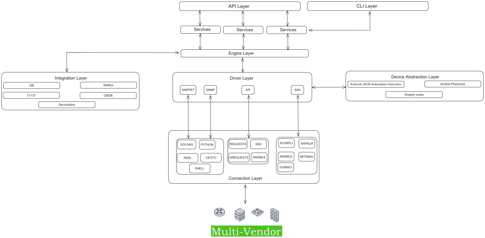
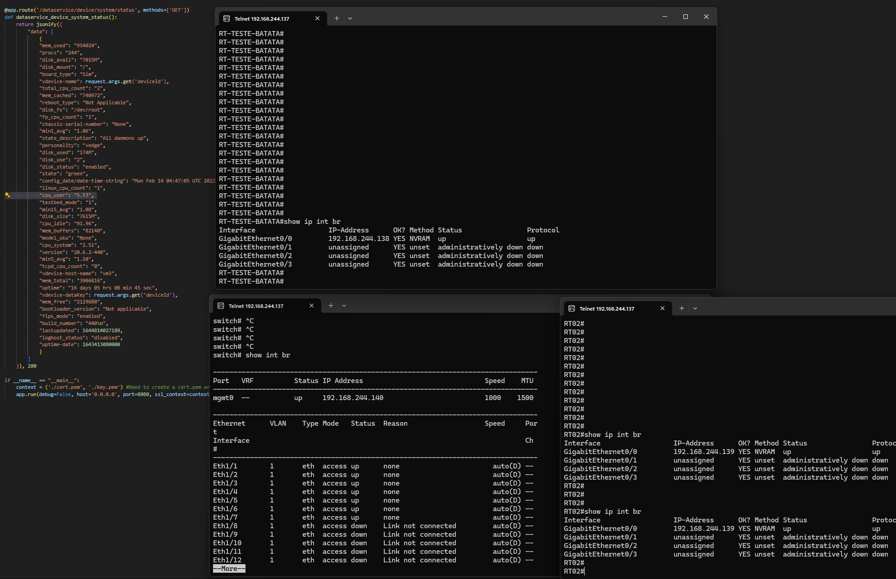
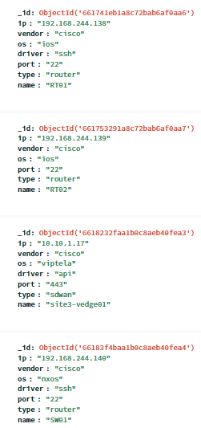
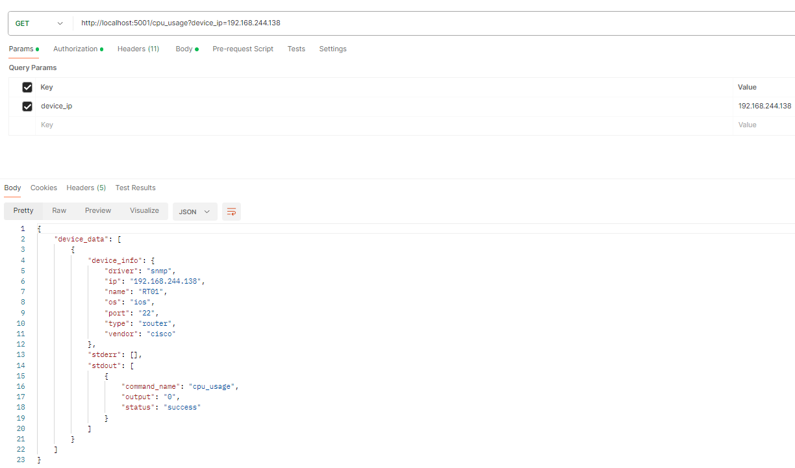
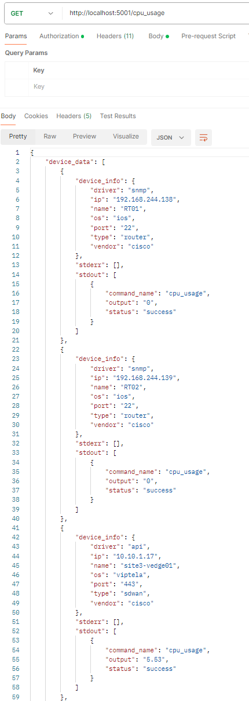
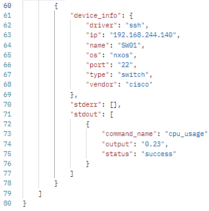
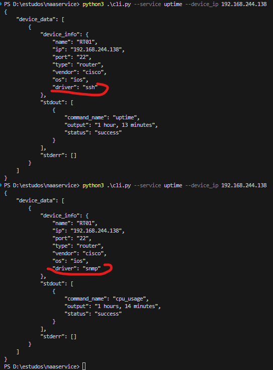
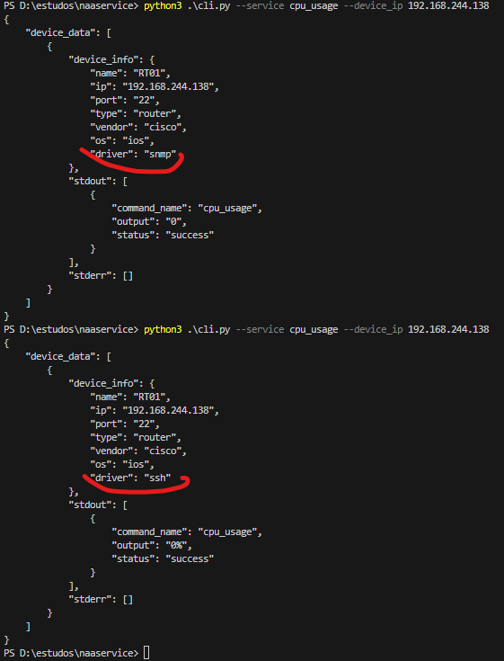
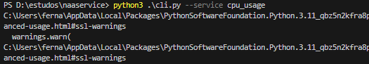
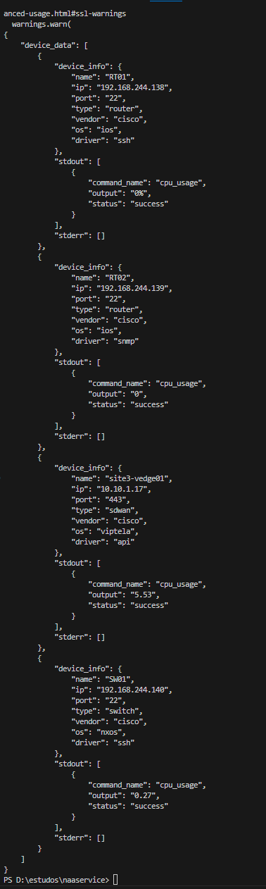

Open Network Orchestration Tool (Prototipo para fins de estudo)
=======
ONOT é uma ferrementa de automação focada na automação de elementos de redes de diversos fabricantes, versões e formas de acesso.
Como um complemento para todo ecossistema de automação existente hoje, o ONOT consegue interagir com scripts em python, playbooks em ansible, comandos SNMP de GET, RestConf/NetConf, SSH, Telnet e RESTAPI, formatando e garantindo uma comunicação a nível corporativo com o ambiente de Rede através da exposição de APIs, com o principal objetivo de unificar, centralizar e padronizar todas ferramentas e maneiras que temos de lidar com automação em um único lugar, independente da sua escolha de connector(seja netmiko, e etc.).

A base da arquitetura é no NSO (Cisco Network Services Orchestrator) com um diferencial de proporcionar maior flexbilidade para que os NEDs( NSO ) sejam qualquer coisa, desde um playbook até um simples SNMP, removendo a complexidade de definir modelos YANG.


Design
=================

   * Abstrai sintaxes de comandos, padroniza outputs independente da forma de conexão (SSH, SNMP, API e etc) e retorna a informação de forma uniforme via REST API ou CLI.
   * Define os comandos e abstrações em arquivos de configuração JSON, facilitando e otimizando novas integrações.
   * Flexibliidade do meio de conexão, suportando SSH, SNMP, REST, NETCONF e RESTCONF e até snippets de qualquer linguagem.
   * Integra com todo ecossistema relevante na automação de redes até 2024, como netmiko, ansible playbooks, shell e outros, afim de possibilitar a reutilização de scripts existentes.
   * Utiliza regex como forma de parsear e padronizar os outputs das informações incorporadas do arquivo JSON.
   * Não necessário instalar agentes ou ferramentas nos elementos, pois a comunicação acontece com suas formas nativas.
   * Possibilita a expansão para outras formas de API como de configuração, reservas de interface/ip e outros.
   * Auto detecta (se possível) o tipo do driver a ser usado(netmiko) como cisco_ios, nxos e etc.
   * Integra com elementos externos para consumir informações dos elementos como IP, Nome, Vendor e etc como NetBox, CMDBs e outros.
   * Os drivers(SSH e etc) interagem com os connectors(implementações do SSH, como Netmiko etc) para alcançar os elementos.
   * Se o driver prioritário padrão não for definido, então uma ordem default será executada (consultar DriverOrder class), e isso também serve caso o driver prioritário falhe, a ordem de 'fallback' é respeitada.
Architecture
=================

  
Use Cases
============
   * Validar uniformemente se uma configuração existe em um grupo de equipamentos.
   * Disponibilizar APIs de serviços para integrações com ferramentas de ITSM como o ServiceNow para reservas automaticas de IP, interfaces, criação de novas VLANs e automaizações de deployments em ambientes de NGN(ACI, DNA, etc).
   * Integração da pipeline da empresa com o ambiente de rede para validações de testes de conectividade.
   * Integração de qualquer ferrramenta com o ambiente de rede via API seguindo as boas práticas.
   * Armazenar o estado da coleta de vários comandos afim de garantir um historíco linear do comportamento da rede.
   * Automatizar vários comandos em diversos equipamentos de vendors e versõse diferentes com apenas um JSON, como por exemplo validações antes e após mudanças no ambiente.

Exemplos
============
   * Definição de um endpoint/serviço para coletar o uso da CPU em 4 equipamentos( 02 Cisco IOS, 01 Cisco NXOS e 01 Viptela(Stub))
   * Simulamos o retorno da API da Viptela com o input/endpoint/output real, por questões de disponibilidade para utilizar no LAB e dificuldade do uso do Always ON da Cisco.
   * Não especificar o device_ip como filtro, então a coleta acontecerá para todos elementos disponíveis no banco
   - Cenário

   
   * Estrutura Banco (NOSQL)



* Definição do serviço
   ```json
      {
         "service_name": "cpu_usage",
         "endpoint": {
            "name": "/cpu_usage",
            "method": "GET",
            "parameters": {
                  "device_ip": {
                     "required": false,
                     "type": "string",
                     "description": "IP address of the device"
                  },
                  "device_name": {
                     "required": false,
                     "type": "string",
                     "description": "Name of the device"
                  },
                  "driver": {
                     "required": false,
                     "type": "string",
                     "description": "Driver to be used to get the CPU usage"
                  }
            }
         },
         "cli": {
            "enabled": true
         },
         "drivers": {
            "ssh": {
                  "netmiko": [
                     {"vendor": "cisco", "os": "ios", "type": "router", "command_name": "cpu_usage", "command": "show processes cpu | include CPU utilization", "parse": "five minutes: (.*)", "group": 1},
                     {"vendor": "cisco", "os": "nxos", "type": "switch", "command_name": "cpu_usage", "command": "show system resources", "parse": "5 minutes:\\s*([0-9.]+)", "group": 1}
                  ],
                  "ansible": [
                     {"vendor": "cisco", "os": "ios", "type": "router", "command_name": "cpu_usage", "command": "./playbooks/cpu_usage_ios.yml", "parse": "five minutes: (.*)", "group": 1},
                     {"vendor": "cisco", "os": "nxos", "type": "router", "command_name": "cpu_usage", "command": "./playbooks/cpu_usage_nxos.yml", "parse": "five minutes: (.*)", "group": 1},
                     {"vendor": "hp", "os": "procurve", "type": "router", "command_name": "cpu_usage", "command": "./playbooks/cpu_usage_hp.yml", "parse": "CPU utilization for five seconds: (.*)", "group": 1}
                  ]
            },
            "snmp": {
                  "pysnmp": [
                     {"vendor": "cisco", "os": "ios", "type": "router", "command_name": "cpu_usage", "command": ".1.3.6.1.4.1.9.2.1.58", "parse": "= (.*)", "group": 1}
                  ]
            },
            "snippet": {
                  "python": [
                     {"vendor": "cisco", "os": "ios", "type": "router", "command_name": "cpu_usage", "command": "./snippets/cpu.py", "parse": "five minutes: (.*)", "group": 1}
                  ],
                  "golang": [
                     {"vendor": "cisco", "os": "ios", "type": "router", "command_name": "cpu_usage", "command": "./snippets/cpu", "parse": "five minutes: (.*)", "group": 1}
                  ]
            },
               "api": {
                  "rest": [
                     {"vendor": "cisco", "os": "viptela", "type": "sdwan", "command_name": "cpu_usage", "command": "device/system/status?deviceId={{device_ip}}", "headers": {"Content-Type": "application/json"}, "field": "data.cpu_user", "parse": "(.*)", "group": 1}
                  ],
                  "restconf": [
                     {"vendor": "cisco", "os": "iosxe", "type": "router", "command_name": "cpu_usage", "command": "data/Cisco-IOS-XE-process-cpu-oper:cpu-usage/cpu-utilization/five-seconds", "headers": {"Content-Type": "application/yang-data+json"}, "field": "Cisco-IOS-XE-process-cpu-oper:five-seconds", "parse": "(.*)", "group": 1}
                  ]
               }
            
            }
      }
   ```

* Exemplo retorno API
   
   ```json
      {
         "device_data": [
            {
                  "device_info": {
                     "driver": "snmp",
                     "ip": "192.168.244.138",
                     "name": "RT01",
                     "os": "ios",
                     "port": "22",
                     "type": "router",
                     "vendor": "cisco"
                  },
                  "stderr": [],
                  "stdout": [
                     {
                        "command_name": "cpu_usage",
                        "output": "0",
                        "status": "success"
                     }
                  ]
            },
            {
                  "device_info": {
                     "driver": "snmp",
                     "ip": "192.168.244.139",
                     "name": "RT02",
                     "os": "ios",
                     "port": "22",
                     "type": "router",
                     "vendor": "cisco"
                  },
                  "stderr": [],
                  "stdout": [
                     {
                        "command_name": "cpu_usage",
                        "output": "0",
                        "status": "success"
                     }
                  ]
            },
            {
                  "device_info": {
                     "driver": "api",
                     "ip": "10.10.1.17",
                     "name": "site3-vedge01",
                     "os": "viptela",
                     "port": "443",
                     "type": "sdwan",
                     "vendor": "cisco"
                  },
                  "stderr": [],
                  "stdout": [
                     {
                        "command_name": "cpu_usage",
                        "output": "5.53",
                        "status": "success"
                     }
                  ]
            },
            {
                  "device_info": {
                     "driver": "ssh",
                     "ip": "192.168.244.140",
                     "name": "SW01",
                     "os": "nxos",
                     "port": "22",
                     "type": "switch",
                     "vendor": "cisco"
                  },
                  "stderr": [],
                  "stdout": [
                     {
                        "command_name": "cpu_usage",
                        "output": "0.23",
                        "status": "success"
                     }
                  ]
            }
         ]
   }
   ```
* Requisição com filtro


* Requisição sem filtro

   

* Exemplo de output via CLI, vejam o mesmo output sendo gerado por drivers diferentes e para serviços diferentes




* Para todos devices




RoadMap
=======
   * Implementar conectors para RestConf/NetConf, Snippets e ansible
   * Armazenamento de estados e configurações no banco
   * Features de aplicar configurações com estados e rollbacks
   * Expandir solução para outros vendors e outros comandos
   * Pipeline CI
   * Testes
   * PyAts e Genie
   * Simplificar JSON
   * Filtros nas requisições (qual campo do output retornar/pesquisar com operadores HTTP)
   * Auto detect para device types ( router, switch etc )
   * Integração com CMDBs/DCIMs/ITSM tools

Authors
=======
Criado por [Fernando](https://github.com/faraujosilva)

