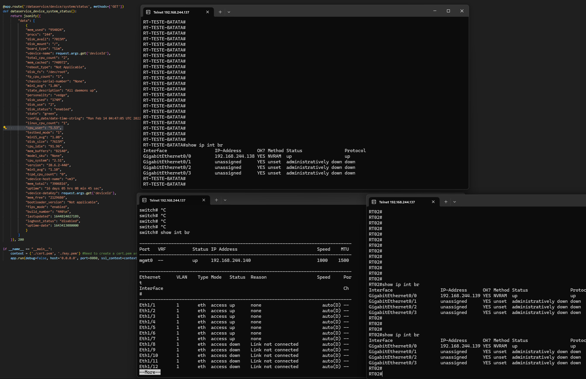
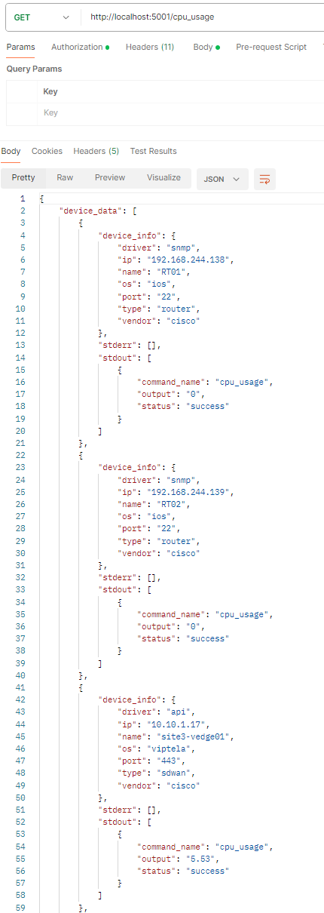

Exemplos
============
   * Definição de um endpoint/serviço para coletar o uso da CPU em 4 equipamentos( 02 Cisco IOS, 01 Cisco NXOS e 01 Viptela(Stub))
   * Simulamos o retorno da API da Viptela com o input/endpoint/output real, por questões de disponibilidade para utilizar no LAB e dificuldade do uso do Always ON da Cisco.
   * Não especificar o device_ip como filtro, então a coleta acontecerá para todos elementos disponíveis no banco

- Cenário

   
* Estrutura Banco (NOSQL)


* Definição do serviço
   ```json
      {
         "service_name": "cpu_usage",
         "endpoint": {
            "name": "/cpu_usage",
            "method": "GET",
            "parameters": {
                  "device_ip": {
                     "required": false,
                     "type": "string",
                     "description": "IP address of the device"
                  },
                  "device_name": {
                     "required": false,
                     "type": "string",
                     "description": "Name of the device"
                  },
                  "driver": {
                     "required": false,
                     "type": "string",
                     "description": "Driver to be used to get the CPU usage"
                  }
            }
         },
         "cli": {
            "enabled": true
         },
         "drivers": {
            "ssh": {
                  "netmiko": [
                     {"vendor": "cisco", "os": "ios", "type": "router", "command_name": "cpu_usage", "command": "show processes cpu | include CPU utilization", "parse": "five minutes: (.*)", "group": 1},
                     {"vendor": "cisco", "os": "nxos", "type": "switch", "command_name": "cpu_usage", "command": "show system resources", "parse": "5 minutes:\\s*([0-9.]+)", "group": 1}
                  ],
                  "ansible": [
                     {"vendor": "cisco", "os": "ios", "type": "router", "command_name": "cpu_usage", "command": "./playbooks/cpu_usage_ios.yml", "parse": "five minutes: (.*)", "group": 1},
                     {"vendor": "cisco", "os": "nxos", "type": "router", "command_name": "cpu_usage", "command": "./playbooks/cpu_usage_nxos.yml", "parse": "five minutes: (.*)", "group": 1},
                     {"vendor": "hp", "os": "procurve", "type": "router", "command_name": "cpu_usage", "command": "./playbooks/cpu_usage_hp.yml", "parse": "CPU utilization for five seconds: (.*)", "group": 1}
                  ]
            },
            "snmp": {
                  "pysnmp": [
                     {"vendor": "cisco", "os": "ios", "type": "router", "command_name": "cpu_usage", "command": ".1.3.6.1.4.1.9.2.1.58", "parse": "= (.*)", "group": 1}
                  ]
            },
            "snippet": {
                  "python": [
                     {"vendor": "cisco", "os": "ios", "type": "router", "command_name": "cpu_usage", "command": "./snippets/cpu.py", "parse": "five minutes: (.*)", "group": 1}
                  ],
                  "golang": [
                     {"vendor": "cisco", "os": "ios", "type": "router", "command_name": "cpu_usage", "command": "./snippets/cpu", "parse": "five minutes: (.*)", "group": 1}
                  ]
            },
               "api": {
                  "rest": [
                     {"vendor": "cisco", "os": "viptela", "type": "sdwan", "command_name": "cpu_usage", "command": "device/system/status?deviceId={{device_ip}}", "headers": {"Content-Type": "application/json"}, "field": "data.cpu_user", "parse": "(.*)", "group": 1}
                  ],
                  "restconf": [
                     {"vendor": "cisco", "os": "iosxe", "type": "router", "command_name": "cpu_usage", "command": "data/Cisco-IOS-XE-process-cpu-oper:cpu-usage/cpu-utilization/five-seconds", "headers": {"Content-Type": "application/yang-data+json"}, "field": "Cisco-IOS-XE-process-cpu-oper:five-seconds", "parse": "(.*)", "group": 1}
                  ]
               }
            
            }
      }
   ```

* Exemplo retorno API
   
   ```json
      {
         "device_data": [
            {
                  "device_info": {
                     "driver": "snmp",
                     "ip": "192.168.244.138",
                     "name": "RT01",
                     "os": "ios",
                     "port": "22",
                     "type": "router",
                     "vendor": "cisco"
                  },
                  "stderr": [],
                  "stdout": [
                     {
                        "command_name": "cpu_usage",
                        "output": "0",
                        "status": "success"
                     }
                  ]
            },
            {
                  "device_info": {
                     "driver": "snmp",
                     "ip": "192.168.244.139",
                     "name": "RT02",
                     "os": "ios",
                     "port": "22",
                     "type": "router",
                     "vendor": "cisco"
                  },
                  "stderr": [],
                  "stdout": [
                     {
                        "command_name": "cpu_usage",
                        "output": "0",
                        "status": "success"
                     }
                  ]
            },
            {
                  "device_info": {
                     "driver": "api",
                     "ip": "10.10.1.17",
                     "name": "site3-vedge01",
                     "os": "viptela",
                     "port": "443",
                     "type": "sdwan",
                     "vendor": "cisco"
                  },
                  "stderr": [],
                  "stdout": [
                     {
                        "command_name": "cpu_usage",
                        "output": "5.53",
                        "status": "success"
                     }
                  ]
            },
            {
                  "device_info": {
                     "driver": "ssh",
                     "ip": "192.168.244.140",
                     "name": "SW01",
                     "os": "nxos",
                     "port": "22",
                     "type": "switch",
                     "vendor": "cisco"
                  },
                  "stderr": [],
                  "stdout": [
                     {
                        "command_name": "cpu_usage",
                        "output": "0.23",
                        "status": "success"
                     }
                  ]
            }
         ]
   }
   ```
* Requisição com filtro


* Requisição sem filtro


